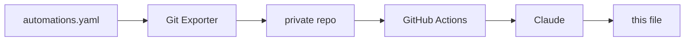

# home-assistant

Documentation of the smart home project I've been building with Home Assistant.

Keeping it written by hand was never going to happen. Every tweak and every new
automation would mean editing a README, leaving me with less time for my projects (including this one). 
So, I automated it. The overview below is generated from my actual automation config and rewritten daily if there were any changes made.
And the best part is: I don't even need to think about it. You can read about the technical details at the end of this file. 

But first, here's the interesting part:

## The Smart Home

<!-- START_AI_SUMMARY -->

This apartment now mostly runs itself: lights follow me from hallway to bathroom to the room I still call "X room" without me touching a switch, laundry taps me on the shoulder when it's done, and the bathroom quietly turns into a jungle when I walk in. The work went into making the automatic behavior get out of the way the instant I want to do something manually.

### Presence-Based Lighting with Manual Override
Hallway, "X room", the bathroom mirror cabinet, and the toilet all turn lights on from occupancy sensors and off after a debounced vacancy period, rather than reacting to every flicker — the hallway waits for a full 30 seconds of continuous "off" before it believes the room is empty, and the mirror cabinet sensor needs 2 seconds of "not occupied" so someone standing still doesn't get plunged into darkness. Each of these rooms has a lighting mode helper (Auto / On / Off) that a wall button can set, and the automation only acts on its own when that helper is in Auto. A separate reset job clears any manual override two hours later, or instantly at the 07:00 morning changeover, but it double-checks the room is actually empty first so a still-occupied space doesn't get its light yanked out from under someone. The hallway also reads a shared time-of-day mode to swap in a dim night-light effect instead of full brightness, and the toilet checks a "vibe mode" helper to switch to red lighting during certain shared ambience scenes.

### Physical Button Mapping
IKEA SOMRIG two-button remotes are mapped per room to short, double, and long presses, each doing something specific rather than a blind toggle: single press restores Auto (forcing the light off first if needed, so the automatic behavior re-triggers cleanly), double press forces full brightness and daylight color temperature with a timed "on" mode, and long press is repurposed entirely — a separate ceiling accent light in the bathroom, an OBS replay-save button in the X room instead of touching any light. The living room's four-button remote has one button running an IR power/downlight sequence, and its double press either pauses the speaker or starts a looping fireplace playlist depending on what's currently playing. A vibration sensor under the mattress also cuts the X room light, but only when the time-of-day mode says it's Night, so an afternoon nap doesn't kill the lights.

### Laundry Workflow
Laundry detection is split in two: a power spike above 1000W marks a cycle as started, guarded by a flag so it doesn't refire mid-wash, and a separate watcher waits for power to sit below 10W for two full minutes before calling the load finished, which rides out the quiet pauses a normal cycle has between stages. A user helper, set by two of the SOMRIG buttons, decides who gets notified when it's ready, falling back to a nag message in Finnish if nobody claimed the load, then resets itself the moment the notification goes out.

### Bathroom Ambience and Self-Healing Audio
Bathroom presence drives a themed audio setup: walking in resumes a playlist on the main speaker with a volume fade instead of a hard cutover, and a second presence sensor near the toilet layers in a secondary speaker and its own playlist — gated so the easter egg only plays once per visit rather than every time someone glances that way. Time-of-day changes reselect the playlist while the room is occupied, and leaving the toilet area checks whether the main room is still occupied before deciding whether to fade the primary speaker out too. Since these speakers occasionally drop off the network, a watchdog waits three minutes for either to go unavailable, sends an alert, and runs a targeted reboot for whichever one failed before reloading the integration.

### Notifications and Maintenance
A printer-ink automation tracks six separate ink channels and only clears the low-ink alert once every one of them is back above threshold. A generic notification manager listens for dismissed phone notifications and re-sends them if whatever they're tagged against is still active, which is what makes ink alerts and similar nags keep coming back until actually resolved instead of dying the moment they're swiped away. A shopping list reminder fires from geofencing against named grocery stores, or from spotting the car's Bluetooth MAC among paired devices, but only if the list has open items and the phone isn't already on home Wi-Fi. Config gets pushed to Git once a day through a one-shot add-on that would otherwise only ever run on restart, and updates apply on their own schedule through a community blueprint rather than anything custom.

<!-- END_AI_SUMMARY -->

## How the automatic documentation works

Once a day, an automation in Home Assistant triggers an add-on that pushes the config to
a private repository. A GitHub Action there passes the automations to Claude, which
groups them into themes and writes the section above. The `description` field on each 
automation is written by hand when I build it, and the model uses it to help it 
determine what the automation does.

The system hashes the automation set before doing anything, so an unchanged config costs no
API calls and produces no commit. It feeds the previous version back as context, so
sections stay where they are instead of being reorganised on every run. And two
deterministic scanners check both the source config and the generated text against
patterns and a private string list before anything is published — if either trips,
the run fails and the README is left alone.

## Hardware

Home Assistant Green serves as the hub, with a Zigbee2MQTT bridge for the Zigbee side.

Around 35 devices in total, across the living room, hallway, toilet, two bedrooms, and
the bathroom (which is called Jungle).

Lighting is mostly WiZ RGB bulbs, with Shelly relays behind fixtures I couldn't
replace. Input comes mostly from IKEA SOMRIG buttons on the walls, Aqara P1 motion sensors,
an Aqara vibration sensor on a door, and a smart plug for appliance
power. A battery IR blaster covers the devices with no network control.

Audio runs on a separate Raspberry Pi Zero 2 W in the bathroom, driving two
Squeezelite instances through a DeLOCK 7.1 USB sound card, Y-split to a pair of
Logitech Z150s and a pair of Trust Polo 2.0s. Music Assistant controls sounds and music.
Elsewhere there's a NVIDIA SHIELD, a Google Nest Mini, a Roborock S5 Max, and an Epson ET-8550.

