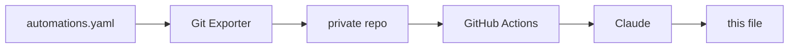

# home-assistant

Documentation of the smart home project I've been building with Home Assistant.

Keeping it written by hand was never going to happen. Every tweak and every new
automation would mean editing a README, leaving me with less time for my projects (including this one). 
So, I automated it. The overview below is generated from my actual automation config and rewritten daily if there were any changes made.
And the best part is: I don't even need to think about it. You can read about the technical details at the end of this file. 

But first, here's the interesting part:

## The Smart Home

<!-- START_AI_SUMMARY -->

Living with this now means lights just show up where I am and disappear when I leave, laundry taps me on the shoulder instead of me remembering to check it, and walking into the bathroom quietly kicks off a whole audio scene. The actual engineering effort went into making sure a button press always wins over the automatic stuff, instantly, rather than fighting it.

### Presence-Based Lighting with Manual Override
Hallway, bedroom, the Jungle's mirror cabinet, and the toilet all turn lights on from occupancy and off after a debounced vacancy period, not on every flicker of a sensor — the hallway waits a full 30 seconds of continuous "off" before it trusts the room is empty, and the mirror cabinet needs 2 seconds of "not occupied" so someone standing still in front of it doesn't get plunged into darkness. Each of these rooms carries a lighting mode helper (Auto / On / Off) that a wall button can set, and the motion logic only fires when that helper says Auto. A separate job resets the override two hours later, or instantly at the 07:00 morning changeover, but only after confirming the room is actually empty, so nobody's light gets pulled out from under them. The hallway and toilet also read the shared time-of-day mode, dropping into a dim night effect after 23:00; the toilet additionally checks vibe mode and turns red during certain shared ambience scenes instead.

### Physical Button Mapping
IKEA SOMRIG remotes handle short, double, and long presses per room, each doing something specific rather than a blind toggle: single press restores Auto (forcing the light off first so the motion logic re-triggers cleanly), double press forces full brightness and daylight color temperature under a timed "on" mode, and long press gets repurposed entirely — an OBS replay-save button in my bedroom instead of touching a light at all. In the Jungle, the same remote that assigns the next laundry load to whoever pressed it also drives a ceiling accent light on long press. The living room's four-button Tuya remote runs an IR power/downlight sequence off one button, and its double press either pauses whatever's playing or starts a looping fireplace playlist depending on state. A vibration sensor under the mattress also kills the bedroom light, but only when time-of-day mode says Night, so a nap doesn't get punished.

### Laundry Workflow
The washing machine lives in the Jungle, and detection is split in two: a power spike above 1000W marks a cycle started, guarded by a flag so it doesn't refire mid-wash, and a separate watcher waits for power to sit below 10W for a full two minutes before calling it done, riding out the quiet pauses a normal cycle has between stages. A user helper, set by remote buttons, decides who gets the notification, falling back to a nag in Finnish if nobody claimed it, then resets itself the moment the message goes out.

### Bathroom Ambience and Self-Healing Audio
Presence in the Jungle drives two audio streams off the same Pi: walking in resumes ambient sound on the primary channel with a volume fade instead of a hard cutover, and stepping into the toilet layers in the secondary channel with its own playlist — gated so that easter egg only plays once per visit, not every time someone glances over. Time-of-day changes reselect the playlist while occupied, and leaving the toilet checks whether the main room is still occupied before deciding whether to fade the primary channel out too. Since these streams occasionally drop off the network, a watchdog on the Home Assistant side waits three minutes for either to go unavailable, notifies me, and reboots whichever one failed before reloading the integration — backed by a second watchdog on the Pi itself that reboots and logs independently.

### Notifications and Maintenance
A printer-ink automation tracks six ink channels separately and only clears the alert once all of them are back above threshold. A generic notification manager listens for dismissed phone notifications and resends them if whatever they're tagged against is still active, which is what keeps ink alerts and similar nags coming back until actually resolved rather than dying the moment they're swiped away. A shopping list reminder fires from geofencing against named stores, or from spotting the car's Bluetooth MAC among paired devices, but only if the list has open items and the phone isn't already on home Wi-Fi.

<!-- END_AI_SUMMARY -->

## How the automatic documentation works

Once a day, an automation in Home Assistant triggers an add-on that pushes the config to
a private repository. A GitHub Action there passes the automations to Claude, which
groups them into themes and writes the section above. The `description` field on each 
automation is written by hand when I build it, and the model uses it to help it 
determine what the automation does.

The system hashes the automation set before doing anything, so an unchanged config costs no
API calls and produces no commit. It feeds the previous version back as context, so
sections stay where they are instead of being reorganised on every run. And two
deterministic scanners check both the source config and the generated text against
patterns and a private string list before anything is published — if either trips,
the run fails and the README is left alone.

## Hardware

Home Assistant Green serves as the hub, with a Zigbee2MQTT bridge for the Zigbee side.

Around 35 devices in total, across the living room, hallway, toilet, two bedrooms, and
the bathroom (which is called Jungle).

Lighting is mostly WiZ RGB bulbs, with Shelly relays behind fixtures I couldn't
replace. Input comes mostly from IKEA SOMRIG buttons on the walls, Aqara P1 motion sensors,
an Aqara vibration sensor on a door, and a smart plug for appliance
power. A battery IR blaster covers the devices with no network control.

Audio runs on a separate Raspberry Pi Zero 2 W in the bathroom, driving two
Squeezelite instances through a DeLOCK 7.1 USB sound card, Y-split to a pair of
Logitech Z150s and a pair of Trust Polo 2.0s. Music Assistant controls sounds and music.
Elsewhere there's a NVIDIA SHIELD, a Google Nest Mini, a Roborock S5 Max, and an Epson ET-8550.

