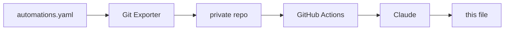

# home-assistant

Documentation of the smart home project I've been building with Home Assistant.

Keeping it written by hand was never going to happen. Every tweak and every new
automation would mean editing a README, leaving me with less time for my projects (including this one). 
So, I automated it. The overview below is generated from my actual automation config and rewritten daily if there were any changes made.
And the best part is: I don't even need to think about it. You can read about the technical details at the end of this file. 

But first, here's the interesting part:

## The Smart Home

<!-- START_AI_SUMMARY -->

This setup runs about twenty automations covering a full apartment: hallway, bathroom, a bedroom-like "X room", toilet, living room, and laundry area. The recurring pattern is presence- or motion-driven control layered with an explicit manual-override mechanism, so that a light switch or button press always wins over the automatic behavior for a fixed cool-down period before reverting to automatic. Beyond lighting, the system handles a themed bathroom audio experience, appliance monitoring (laundry, printer, speakers), and a notification layer that survives being dismissed.

### Presence-Based Lighting with Manual Override
Several rooms (hallway, the "X room", the bathroom mirror cabinet, the toilet) turn lights on from occupancy or presence sensors and off again after a period of confirmed vacancy, using `wait_for_trigger` or `wait_template` with a debounce (for example, the hallway waits for 30 continuous seconds of "off" before considering the room empty, and the bathroom cabinet sensor needs 2 seconds of "not occupied" to avoid flicker from someone standing still). What makes these interesting is the mode-switching: each of these rooms has an `input_select` (`Auto`, `On (Timer)`, `Off (Timer)`, `Off (Morning)`) that a wall button can set, and the automation only acts automatically when that helper is in `Auto`. A separate "reset to Auto" automation clears any manual override two hours after it was set, or immediately at the 07:00 morning time change, so a light deliberately left on overnight doesn't stay stuck in that state forever. The hallway automation also cross-references a global time-of-day mode to swap in a dim "Night light" effect instead of full brightness.

### Physical Button Mapping
IKEA SOMRIG two-button remotes are mapped per room to short/long/double press combinations, each wired to a specific action rather than a generic toggle: single press restores Auto mode (turning the light off first if it wasn't already off, to force a clean re-trigger), double press forces full-brightness daylight-temperature light and a timed "On" mode, and long press is repurposed entirely — in the bathroom it drives the ceiling accent light, and in the X room a long press on either button triggers an OBS replay-save button instead of touching lights at all. The living room uses a four-button remote where the fourth button is split between an IR power/downlight command sequence and, on double press, either pausing a speaker or starting a looping "fireplace" playlist depending on current playback state.

### Laundry Workflow
Laundry detection is split into two halves: a power-threshold trigger above 1000W marks a cycle as started (guarded by a boolean so retriggers mid-cycle don't fire again), and a separate automation watches for power staying below 10W for two full minutes before declaring the load finished, which avoids false completions during a normal pause between wash stages. A "user" helper set by two of the SOMRIG buttons decides who gets notified when laundry is ready, with a default fallback ("nobolonski") for when nobody claimed the load, followed by a joke Finnish nag message.

### Bathroom Ambience and Self-Healing Audio
The bathroom presence sensors drive a themed audio system: entering starts or resumes a playlist on the primary speaker with a volume fade rather than a hard cutover, and a second presence sensor for the toilet area layers in a secondary speaker with its own playlist, gated by a boolean so the "easter egg" only plays once per bathroom visit instead of every time someone glances toward the toilet. Time-of-day changes also reselect the playlist while occupied. Because these speakers occasionally drop off the network, a separate watchdog automation waits three minutes for either speaker to be reported `unavailable`, sends an alert, and runs a targeted reboot script for whichever unit failed before reloading the integration.

### Notifications and Maintenance
A printer-ink automation tracks six separate ink-level sensors and manages a single low-ink boolean that only clears once every channel is back above threshold. A generic "Persistent Notification Manager" listens for dismissed mobile notifications and re-sends them if the underlying task/alert entity it's tagged against is still active, which is what makes ink alerts and similar reminders keep nagging until actually resolved instead of just going away when swiped. A shopping-list reminder fires either from geofencing against named grocery stores or from detecting the car's Bluetooth MAC among paired devices, but only if the shopping list has open items and the phone isn't already on the home network. A boot-time automation resets a couple of helper states after a restart so other automations don't inherit stale assumptions, and updates apply on a schedule via a community blueprint rather than a custom rule.

<!-- END_AI_SUMMARY -->

## How the automatic documentation works

Once a day, an automation in Home Assistant triggers an add-on that pushes the config to
a private repository. A GitHub Action there passes the automations to Claude, which
groups them into themes and writes the section above. The `description` field on each 
automation is written by hand when I build it, and the model uses it to help it 
determine what the automation does.

The system hashes the automation set before doing anything, so an unchanged config costs no
API calls and produces no commit. It feeds the previous version back as context, so
sections stay where they are instead of being reorganised on every run. And two
deterministic scanners check both the source config and the generated text against
patterns and a private string list before anything is published — if either trips,
the run fails and the README is left alone.

## Hardware

Home Assistant Green serves as the hub, with a Zigbee2MQTT bridge for the Zigbee side.

Around 35 devices in total, across the living room, hallway, toilet, two bedrooms, and
the bathroom (which is called Jungle).

Lighting is mostly WiZ RGB bulbs, with Shelly relays behind fixtures I couldn't
replace. Input comes mostly from IKEA SOMRIG buttons on the walls, Aqara P1 motion sensors,
an Aqara vibration sensor on a door, and a smart plug for appliance
power. A battery IR blaster covers the devices with no network control.

Audio runs on a separate Raspberry Pi Zero 2 W in the bathroom, driving two
Squeezelite instances through a DeLOCK 7.1 USB sound card, Y-split to a pair of
Logitech Z150s and a pair of Trust Polo 2.0s. Music Assistant controls sounds and music.
Elsewhere there's a NVIDIA SHIELD, a Google Nest Mini, a Roborock S5 Max, and an Epson ET-8550.

