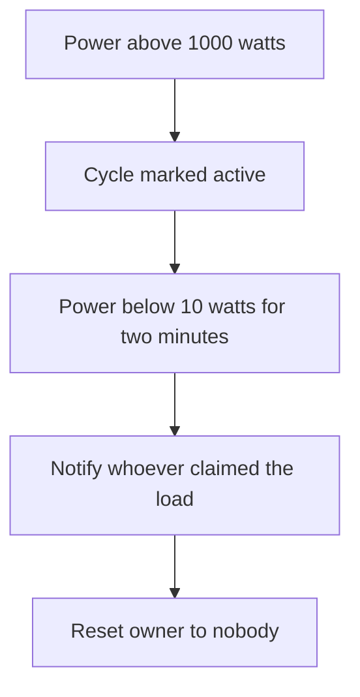
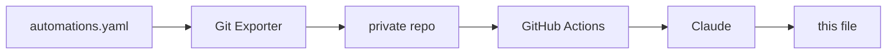

# home-assistant

Documentation of the smart home project I've been building with Home Assistant.

Keeping it written by hand was never going to happen. Every tweak and every new
automation would mean editing a README, leaving me with less time for my projects (including this one). 
So, I automated it. The overview below is generated from my actual automation config and rewritten daily if there were any changes made.
And the best part is: I don't even need to think about it. You can read about the technical details at the end of this file. 

But first, here's the interesting part:

## The Smart Home

<!-- START_AI_SUMMARY -->

This flat handles the small stuff on its own, so I don't have to think about it. Lights find me in the hallway, my bedroom, and the Jungle, then switch off once I've actually left. Laundry finds its owner and taps them on the shoulder when it's done. Walking into the bathroom kicks off its own little sound scene, and the whole place quietly resends any nag I've ignored.

### Lights that follow me, until I tell them not to
Hallway, my bedroom, the Jungle's mirror cabinet, and the Toilet all turn lights on from motion or presence. The hallway waits 30 seconds of no motion before switching off, so it doesn't strobe on and off while I stand still. The mirror cabinet only needs 2 seconds. Each of these rooms has its own lighting mode, and the motion behaviour only runs while that mode is set to Auto. A wall button can knock a room out of Auto, and two hours later, or right at the 7am morning switch, it resets itself back to Auto, but only if the room checks out as empty first. The hallway and Toilet also watch the time of day, going dim after 11pm, and the Toilet checks vibe mode too, turning red during certain shared scenes.

```mermaid
stateDiagram-v2
    "Auto" --> "On for a while": "double press"
    "Auto" --> "Off for a while": "single press"
    "On for a while" --> "Auto": "two hours or morning"
    "Off for a while" --> "Auto": "two hours or morning"
```

### The buttons on the wall
Most rooms have an IKEA SOMRIG remote. The Living Room has a four button Tuya one. A single press puts a room back to Auto. A double press forces full brightness and a cold white for a while. A long press gets repurposed entirely in some rooms, like saving an OBS replay from my bedroom instead of touching a light. In the Jungle, the same remote that assigns the next laundry load to whoever pressed it also turns a ceiling accent light on with a long press. The Living Room remote fires an IR sequence for the TV and downlight off one button, and its double press either pauses whatever's playing or starts a looping fireplace playlist. A vibration sensor under my mattress also kills my bedroom light, but only at night, so a nap doesn't get punished.

### Laundry tells me when it's done
The washing machine lives in the Jungle. A power draw over 1000 watts means a cycle has started. Power sitting under 10 watts for two full minutes means it's actually finished, not just paused between stages.



A remote button assigns the next load to me or my flatmate before we start it. If nobody claimed it, the notification nags in Finnish and blames nobody in particular. Either way, the owner resets the moment the message goes out.

### The Jungle sounds alive
Walking into the Jungle brings ambient sound back in, fading up over a few seconds rather than snapping on. Step into the Toilet on top of that and a second sound joins in with its own playlist, though that easter egg only plays once per visit. Changing time of day swaps the ambient playlist while I'm still in the room. Leaving the Toilet checks whether the Jungle is still occupied before deciding whether to fade the main sound out too. The two sounds run off two players on the same Pi, and they sometimes drop off the network. If either goes unavailable for three minutes, I get a notification and it reboots itself and reloads. There's a second watchdog running directly on the Pi that reboots and logs on its own, in case Home Assistant can't reach it at all.

### Things that nag me until I deal with them
The printer tracks six ink levels on its own and only clears the alert once every one of them is back above threshold. Dismissed phone notifications come back on their own if whatever they were about is still true. That's what keeps an ink alert returning every time I swipe it away without refilling. A shopping list reminder fires when I walk into one of a few named stores, or when the car's Bluetooth shows up paired to my phone, but only if the list actually has items on it and I'm not already home.

<!-- END_AI_SUMMARY -->

## How the automatic documentation works



Once a day, an automation in Home Assistant triggers an add-on that pushes the config to
a private repository. A GitHub Action there passes the automations to Claude, which
groups them into themes and writes the section above. The `description` field on each 
automation is written by hand when I build it, and the model uses it to help it 
determine what the automation does.

The system hashes the automation set before doing anything, so an unchanged config costs no
API calls and produces no commit. It feeds the previous version back as context, so
sections stay where they are instead of being reorganised on every run. And two
deterministic scanners check both the source config and the generated text against
patterns and a private string list before anything is published — if either trips,
the run fails and the README is left alone.


## Hardware

Home Assistant Green serves as the hub, with a Zigbee2MQTT bridge for the Zigbee side.

Around 35 devices in total, across the living room, hallway, toilet, two bedrooms, and
the bathroom (which is called Jungle).

Lighting is mostly WiZ RGB bulbs, with Shelly relays behind fixtures I couldn't
replace. Input comes mostly from IKEA SOMRIG buttons on the walls, Aqara P1 motion sensors,
an Aqara vibration sensor on a door, and a smart plug for appliance
power. A battery IR blaster covers the devices with no network control.

Audio runs on a separate Raspberry Pi Zero 2 W in the bathroom, driving two
Squeezelite instances through a DeLOCK 7.1 USB sound card, Y-split to a pair of
Logitech Z150s and a pair of Trust Polo 2.0s. Music Assistant controls sounds and music.
Elsewhere there's a NVIDIA SHIELD, a Google Nest Mini, a Roborock S5 Max, and an Epson ET-8550.

