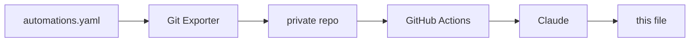

# home-assistant

Documentation of the smart home project I've been building with Home Assistant.

Keeping it written by hand was never going to happen. Every tweak and every new
automation would mean editing a README, leaving me with less time for my projects (including this one). 
So, I automated it. The overview below is generated from my actual automation config and rewritten daily if there were any changes made.
And the best part is: I don't even need to think about it. You can read about the technical details at the end of this file. 

But first, here's the interesting part:

## The Smart Home

<!-- START_AI_SUMMARY -->

This flat handles the small stuff on its own, so I don't have to think about it. Lights find me in the hallway, my bedroom, and the Jungle, then let go the moment I've told them to behave differently. The whole system reads off two shared moods, and if any of the machinery in the bathroom trips over itself, it tries to fix itself before I even notice.

### Welcome to the Jungle
Walking into the bathroom gives you an adventurous transportation into the Jungle: vines climbing the walls, birds perched on the shelves, and a monkey hanging from the ceiling holding a lightbulb that warms up the second it senses you. A moment later the room starts breathing around you, ambient jungle sound rising from two Squeezelite players on a Raspberry Pi, run through Music Assistant. The soundtrack isn't static: crickets take over at night, birds return with the daylight, and on rare visits a little melody sneaks in instead of the usual ambience. Step close to the mirror cabinet and its light switches on for you, gone again two seconds after you back away. Linger by the toilet in the corner of the Jungle and, once in a while, a second layer of sound joins in for a bit, though that particular surprise only shows up once per visit before it settles back down.

### Brain's Virtual Memory Extension
I couldn't stop at automating the home itself; I wanted to stop having to remember things too. My phone knows the difference between passing a grocery store and actually walking into one, and if my shopping list has anything on it, it tells me before I've even parked. The washing machine in the Jungle taps whoever claimed the load on the shoulder the moment it drops under 10 watts for two minutes straight, no more wandering down to check. The printer keeps closer tabs on its six ink levels than I ever could, and if I swipe away its warning without actually refilling it, it just tells me again. All of it is the same idea: offload the remembering, keep the living care-free.

### Automatic lights, until you say otherwise
Motion runs the lights in the hallway and my bedroom on their own, but automatic is only pleasant until it does the wrong thing at the wrong moment. So both rooms have a mode, and a single button press can pull it out of Auto entirely, force it fully on, or force it off for the rest of the morning. Nothing fights back in the moment. It just quietly lets the override expire two hours later, or resets itself the instant the day flips to Morning, but only once the room checks out as actually empty.

### Time of Day and Vibe Modes
Everything in the flat reads off two shared states. Time of Day cycles itself through Morning, Day, Evening, and Night on a clock, nudging lights warmer and dimmer as the night sets in. Vibe Mode is the one I set by hand, for Party, Sauna, Cozy Nook, or Movie, and it wins the argument over whatever Time of Day thinks the moment is. Movie keeps everything near the living room dim so nobody watching gets blinded by a stray light. Maintenance holds every light on and every speaker silent for as long as I need to work on something, until I switch it back off myself. The Toilet even leans into a shared mood, turning its light red whenever one of the shared vibes is active.

### When something breaks
The Jungle's speakers occasionally drop off the network mid-scene, and when they do, Home Assistant notices within three minutes, tells me something's wrong, and reboots the offending player itself before reloading it. There's a second watchdog running directly on the Pi as well, rebooting and logging entirely on its own, for the moments Home Assistant can't even reach it to ask. The bigger this system gets, the less I want to be the one checking on it, so the goal everywhere is the same: set it up once, and let it notice its own problems before I do.

<!-- END_AI_SUMMARY -->

## How the automatic documentation works

Once a day, an automation in Home Assistant triggers an add-on that pushes the config to
a private repository. A GitHub Action there passes the automations to Claude, which
groups them into themes and writes the section above. The `description` field on each 
automation is written by hand when I build it, and the model uses it to help it 
determine what the automation does.

The system hashes the automation set before doing anything, so an unchanged config costs no
API calls and produces no commit. It feeds the previous version back as context, so
sections stay where they are instead of being reorganised on every run. And two
deterministic scanners check both the source config and the generated text against
patterns and a private string list before anything is published — if either trips,
the run fails and the README is left alone.

## Hardware

Home Assistant Green serves as the hub, with a Zigbee2MQTT bridge for the Zigbee side.

Around 35 devices in total, across the living room, hallway, toilet, two bedrooms, and
the bathroom (which is called Jungle).

Lighting is mostly WiZ RGB bulbs, with Shelly relays behind fixtures I couldn't
replace. Input comes mostly from IKEA SOMRIG buttons on the walls, Aqara P1 motion sensors,
an Aqara vibration sensor on a door, and a smart plug for appliance
power. A battery IR blaster covers the devices with no network control.

Audio runs on a separate Raspberry Pi Zero 2 W in the bathroom, driving two
Squeezelite instances through a DeLOCK 7.1 USB sound card, Y-split to a pair of
Logitech Z150s and a pair of Trust Polo 2.0s. Music Assistant controls sounds and music.
Elsewhere there's a NVIDIA SHIELD, a Google Nest Mini, a Roborock S5 Max, and an Epson ET-8550.

