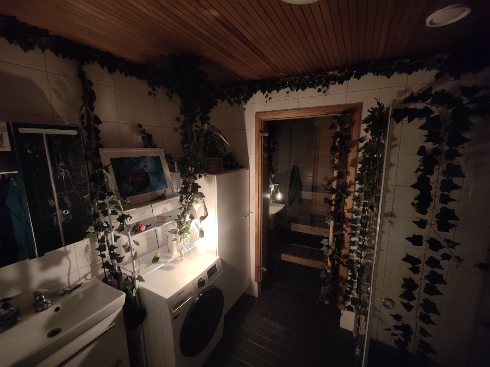
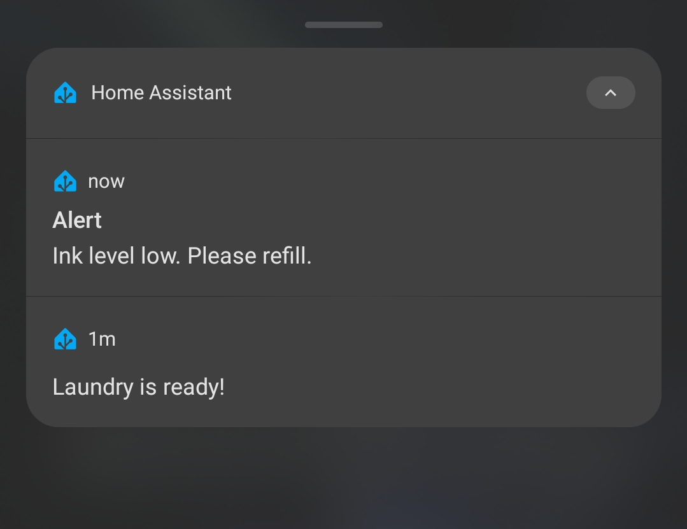
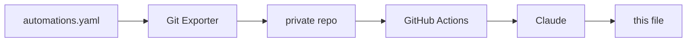

# home-assistant

Documentation of the smart home project I've been building with Home Assistant.

I figured that if I'm automating the house, the documentation of it ought to be automated as well. And indeed this page is.

It's generated from automations.yaml — the actual, complete automation code running my home, sitting right there in this repository — plus a set of accurately tuned instructions for the model. 
The overview below rewrites itself whenever I make changes to my smart home. And the best part is: I don't even need to think about it anymore. It just works. Even the images get inserted, deterministically, in their correct spots!
There's a description of how that works at the end of the file.

But first, here's the interesting part:

## The Smart Home

<!-- START_AI_SUMMARY -->

This is the home I've built around me, piece by piece: a hallway that lights itself, a bathroom that turns into a jungle, notifications that remember things so I don't have to, and a handful of failsafes running quietly in the background so it mostly takes care of itself. Here's how it actually behaves, room by room and mode by mode.

### Welcome to the Jungle

Walking into the bathroom gives you an adventurous transportation into the Jungle: vines cover the walls, birds sit on the shelves, and a monkey hangs from the ceiling holding a lightbulb that glows warm the moment you step in. A beat later the room wakes up around you, sound pouring out of the ceiling speakers wired to a Raspberry Pi and orchestrated through Music Assistant. The soundtrack isn't static — it tracks the time of day, so late at night the room settles into crickets while the middle of the day brings the birds back. Stay long enough and, on the rare occasion, a little melody slips in, an easter egg that only shows up once in a while. Step up to the mirror to wash your hands and the cabinet light above it switches on by itself, sensing you're right there, then fades back off a couple of seconds after you turn away.

### Brain's Virtual Memory Extension

I couldn't stop at automating the home itself; I wanted my daily life outside it handled too. My phone comes with me everywhere, so it's become the messenger. Walk near a grocery store and it lists everything sitting on the shopping list, so I never stand in an aisle trying to remember what I ran out of. Finish a load of laundry — tracked by a smart plug watching the washing machine's power draw, since there's no sensor inside the machine itself — and it tells whoever started the load that it's ready. When the printer's ink runs low, it sends a notification that doesn't just disappear when swiped; it keeps quietly nagging until I actually refill it. The whole point is treating my phone as an extension of memory, so I can move through the day a little more care-free and trust that the things I'd otherwise forget will find me anyway.

### Automatic lights, until you say otherwise

Motion handles most of the lighting around the house — the hallway lights itself as you pass through, and so does my bedroom. But automatic lighting stops feeling clever the moment it does something you didn't want, so both rooms sit right next to a wall button too. A press takes the room off automatic and does exactly what you asked instead, whether that means holding the lights off or locking them on. The important part is what happens next: the override quietly expires on its own after a couple of hours, or resets the next morning, and the room slides back onto automatic without me ever having to remember to switch it back myself. The automation never fights you; it just steps aside when you want it to, and steps back in later, on its own.

### Time of Day and Vibe Modes

Underneath all of it are two modes that almost everything else reads from. Time of Day moves through Morning, Day, Evening, and Night on its own schedule, deciding things like whether the toilet light comes on a soft warm tone at night instead of plain white. Vibe Mode sits above it, set by hand for a particular atmosphere — Party, Sauna, Cozy Nook, Movie — and it usually wins the argument when the two disagree, tinting that same toilet light red regardless of the hour. Switch on Maintenance and the lights stay lit and the sound stays off until I switch it back, useful for cleaning or fixing things without the house trying to help. Switch on Movie and the areas near the living room stay darker so nothing spills onto the screen while someone's watching.

### When something breaks

The bigger this system gets, the less I want to be the one who notices when something's gone wrong. If the Jungle speakers drop off the network, Home Assistant catches it after a few minutes of silence, sends me a notification, and tries rebooting the speaker before reloading its connection. As a second line of defense there's a watchdog running directly on the Raspberry Pi, independent of Home Assistant entirely, that reboots and logs on its own in case the whole Pi becomes unreachable. The goal isn't zero failures — with enough moving parts something will eventually hiccup — it's having the house notice and fix itself before I do. Set and forget, as much as a jungle bathroom can be.

<!-- END_AI_SUMMARY -->

## How the automatic documentation works

Once a day, an automation in Home Assistant triggers an add-on that pushes the config to
a private repository. A GitHub Action there passes the automations to Claude, which
groups them into themes and writes the section above. The `description` field on each 
automation is written by hand when I build it, and the model uses it to help it 
determine what the automation does. Photos are placed by the script rather than the model, 
matched to sections by filename, so the same input always produces the same layout. 
The model only writes the text, and it never handles the images.

The system hashes the automation set before doing anything, so an unchanged config costs no
API calls and produces no commit. It feeds the previous version back as context, so
sections stay where they are instead of being reorganised on every run. And two
deterministic scanners check both the source config and the generated text against
patterns and a private string list before anything is published — if either trips,
the run fails and the README is left alone.

## Hardware

Home Assistant Green serves as the hub, with a Zigbee2MQTT bridge for the Zigbee side.

Around 35 devices in total, across the living room, hallway, toilet, two bedrooms, and
the bathroom (which is called Jungle).

Lighting is mostly WiZ RGB bulbs, with Shelly relays behind fixtures I couldn't
replace. Input comes mostly from IKEA SOMRIG buttons on the walls, Aqara P1 motion sensors,
an Aqara vibration sensor on a door, and a smart plug for appliance
power. A battery IR blaster covers the devices with no network control.

Audio runs on a separate Raspberry Pi Zero 2 W in the bathroom, driving two
Squeezelite instances through a DeLOCK 7.1 USB sound card, Y-split to a pair of
Logitech Z150s and a pair of Trust Polo 2.0s. Music Assistant controls sounds and music.
Elsewhere there's an NVIDIA SHIELD, a Google Nest Mini, a Roborock S5 Max, and an Epson ET-8550.

